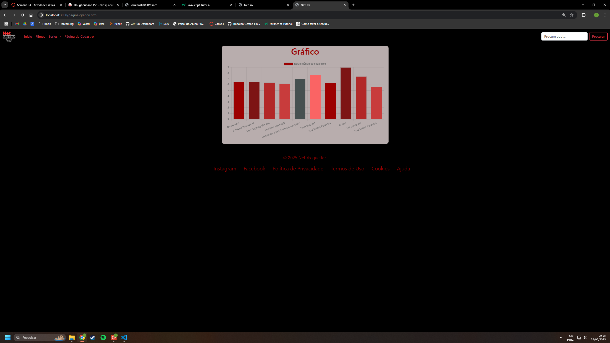
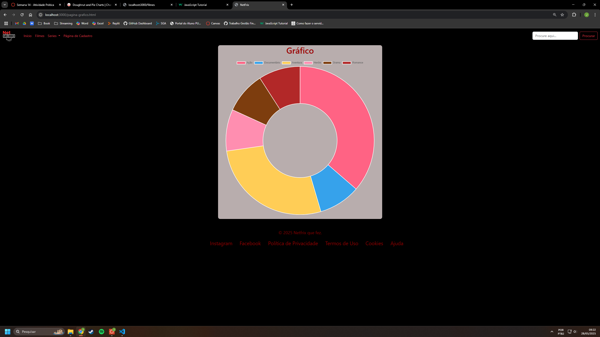

# Trabalho Prático - Semana 14

A partir dos dados cadastrados na etapa anterior, vamos trabalhar formas de apresentação que representem de forma clara e interativa as informações do seu projeto. Você poderá usar gráficos (barra, linha, pizza), mapas, calendários ou outras formas de visualização. Seu desafio é entregar uma página Web que organize, processe e exiba os dados de forma compreensível e esteticamente agradável.

Com base nos tipos de projetos escohidos, você deve propor **visualizações que estimulem a interpretação, agrupamento e exibição criativa dos dados**, trabalhando tanto a lógica quanto o design da aplicação.

Sugerimos o uso das seguintes ferramentas acessíveis: [FullCalendar](https://fullcalendar.io/), [Chart.js](https://www.chartjs.org/), [Mapbox](https://docs.mapbox.com/api/), para citar algumas.

## Informações do trabalho

- Nome: João Vitor Alves Amaral
- Matricula: 882594
- Proposta de projeto escolhida: Site de Streaming de Vídeos
- Breve descrição sobre seu projeto: Criação de um site plataforma de Streaming inspirado em uma das maiores plataformas atuais, utilizando API para gráficos agora.

**Print da tela com a implementação**

Implementação feita pelo Charts.js, o tipo escolhido foi o de barra comum, pois achei que é o que mais combina com esse tipo de aplicação, foram utilizados as informações de quantidade de votos em cada filme e no outro a média de avaliações.

